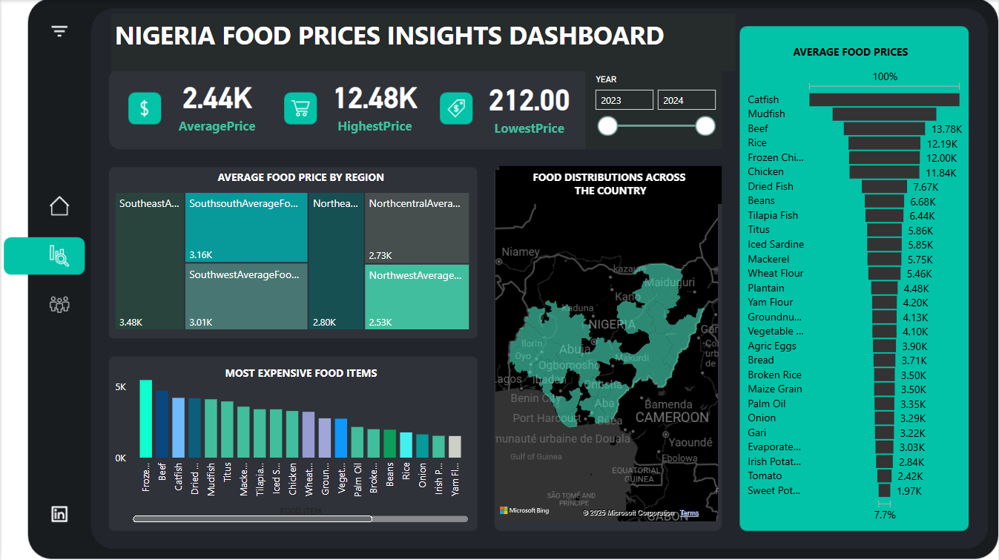

# NIGERIA-FOOD-PRICES-DASHBOARD

This Power BI dashboard presents a visual exploration of food price trends across Nigeria. The dashboard offers interactive and data-driven insights into the regional distribution of food prices, top expensive food items, and overall price movement between 2023 and 2024.

---

## 📊 Key Features

- **KPIs Display**:
  - Average Food Price
  - Highest Food Price
  - Lowest Food Price
- **Regional Insights**:
  - Average food prices across Nigeria's six geopolitical zones.
- **Food Category Breakdown**:
  - Visual comparison of the most expensive food items.
  - Average food price ranking.
- **Interactive Map**:
  - Geographic distribution of food prices across states.
- **Time Filter**:
  - Toggle between years (2023 and 2024).

---

## 📌 Key Insights

- **Catfish**, **Beef**, and **Rice** consistently rank among the highest-priced food items.
- **Northwest** and **Northcentral** regions show the lowest average food prices.
- Clear seasonal and regional disparities in food prices.

---

## 🚀 How to Use

1. Download the `.pbix` file (coming soon).
2. Open it using Power BI Desktop.
3. Interact with slicers to filter by year and region.
4. Explore maps and charts to understand the distribution and trend of food prices.

---

## 🛠 Tools Used

- **Power BI Desktop**
- **Microsoft Bing Maps (for geo-visualization)**
- **Nigerian Food Market Dataset (source not shown)**

---

## 👤 Author

**Philip Oklu**  
_Data Analyst | Power BI Developer_  
[LinkedIn](https://www.linkedin.com/in/philip-oklu) 
[GitHub](https://github.com/PhilipOklu)

---

## 📄 License

This project is licensed under the MIT License - see the [LICENSE](LICENSE) file for details.
